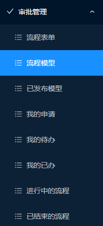

# Spring-vue3-activiti

#### 介绍
基于vue3 typescript 的activiti 审批流程，后端jeecg Springboot.

#### 安装教程

1.  spring 的java代码 放到jeecg spring 后台启动
2.  前端代码放到对应的view3 路径即可

#### 参与贡献

1、 感谢jeecg 基础开源代码
2、 感谢 activiti 开源代码
3、 感谢其他开源参考代码的贡献者

#### 学习
为了更多，更好的开源项目，大家可以随时加入本社区免费开源学习。
